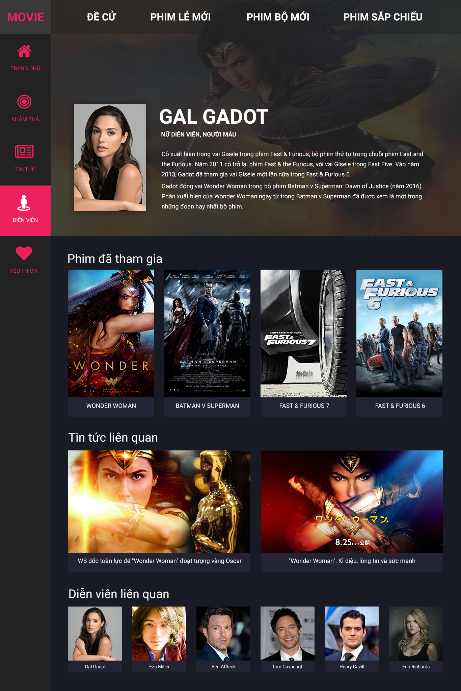
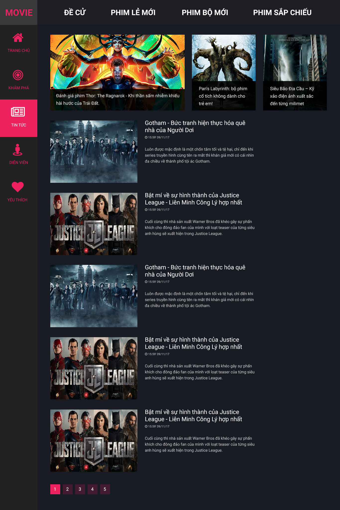

# project-website-movie-template
Project website Movie Template

<p align="center">
  
</p>

<p align="center">
  
</p>

#### Install Package
```
yarn install
```

#### Gulp Browser-sync
```
gulp default
```
#### Gulp Build
```
gulp build
```
